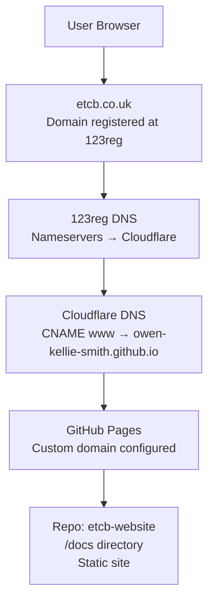

# etcb-website


**Live site:**  https://www.etcb.co.uk/     [How?](#domain-name-management-info)

**Alias Live site:**  https://www.exmouthtownband.co.uk/     [How?](#domain-name-redirect)

---

## How to contribute

To propose any change, either create a new [issue](https://github.com/owen-kellie-smith/etcb-website/issues) and describe what you would like to see or create what you would like to see and seek approval for it i.e.
1. [Fork](https://github.com/owen-kellie-smith/etcb-website/fork) the repository.
2. [Clone your fork](#getting-started-with-this-repo) and check it passes all the current tests.
3. Create a new branch.
4. [Make](#content-changes) your changes.
5. Check the changed branch still passes all the tests.
6. [Create](https://github.com/owen-kellie-smith/etcb-website/compare) a pull request.

### Content changes

The website is in the [docs](docs) folder.

If you are proposing an edit for an existing page (e.g. to #contact) then make the edit to the relevant fragment e.g. in `docs/contact.html`, commit your change and submit a pull request. 

If you are proposing a new page (e.g. `#practices`) in the [current format](#current-format), then you need **three** changes:

1. **Create the content fragment** e.g. copy `docs/contact.html` to `docs/practices.html`  
   Edit the redirect script at the very top so that visiting the file directly sends users to the correct page.  Your new fragment will look like (once you have finished):
   ```html
   <script data-redirect>location.replace('./index.html#practices');</script>

   <h1>Practices</h1>
   <p>New content that describes practices ...</p>
   <p>Practice venues sometimes change so check ... etc ...</p>
   ```

2. **Register the page** in `docs/js/import.js`  
   Add the new page key to both arrays near the top of `docs/js/import.js`:
   ```js
   const VALID_PAGES = ['latest', 'about', ..., 'practices'];

   const PAGE_TITLES = {
     ...
     practices: 'ETCB - Practices',
   };
   ```

3. **Add a menu link** in `docs/includes/header.html`  
   Copy one of he existing links to add e.g.:
   ```html
   <li><a href="#practices">Practices</a></li>
   ```
   
4. (Optional) Add your new page key to the list of hashPages tested in `tests/pages.spec.ts`.

   
### Current format

The site is a single-page application. Only `docs/index.html` is ever loaded by the browser. Clicking a menu link changes the URL hash (e.g. `#contact`), and the router in `docs/js/import.js` fetches the matching fragment file (`contact.html`) and inserts its content into the page. Inserting the fragment may appear less flickery than a full page reload, but sometimes makes it look like the menu hasn't worked.

---

## Getting started with this repo

### Download the repo and run tests
```
git clone https://github.com/<your-github-user-name>/etcb-website.git
cd avo-website
npm install
npx playwright install
npm run check
```

If everything works you will see something like (for each of several browsers)
```
✓ internal links and assets are valid
✓ homepage loads
✓ latest page loads via hash route
✓ about page loads via hash route
...
```

To view the site locally:
```
python3 -m http.server 4173 
```
then open `http://localhost:4173`


---
## Domain name management (info)
As a demo, [etcb.co.uk is registered (at 123reg.co.uk), for a year until March 2027. 123reg DNS settings forward to Cloudflare.](https://www.whois.com/whois/etcb.co.uk) Cloudflare [has a CNAME for www(.etcb.co.uk) which is owen-kellie-smith.github.io](https://mxtoolbox.com/SuperTool.aspx?action=mx%3awww.etcb.co.uk&run=toolpage).  Github fowards to etcb-website/docs via this repo > Settings > Pages (Custom Domain) which created [a CNAME in docs](docs/CNAME).




## Domain name redirect

As a demo, [exmouthtownband.co.uk is registered (at fasthosts), for a year until March 2027. Fasthosts DNS settings forward to Cloudflare.](https://www.whois.com/whois/exmouthtownband.co.uk) Cloudflare [redirects exmouthtownband.co.uk to etcb.co.uk](https://redirectcheck.io/check?url=http://exmouthtownband.co.uk).

---
## License

MIT

---

## Authors

See GitHub contributors for the list of contributors to this project.

